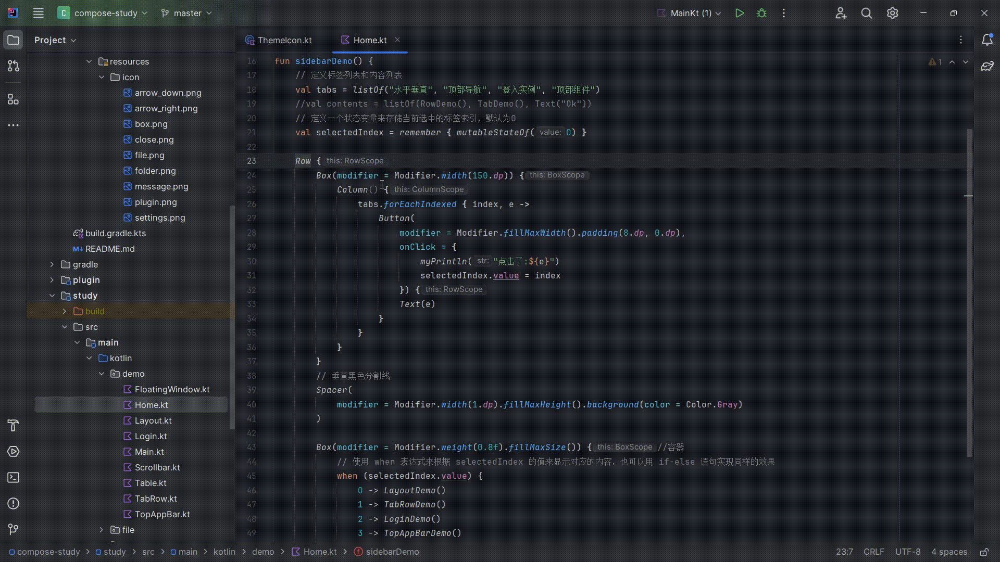

# ComposeTool

- English

## introduce

- Based on the following plugins

| 作用           | 插件                                                                                        | 仓库                                                    |
|--------------|-------------------------------------------------------------------------------------------|-------------------------------------------------------|
| Compose 组件包裹 | [ComposeHelper](https://plugins.jetbrains.com/plugin/18323-compose-helper)                | https://github.com/thelumiereguy/ComposeHelperPlugin  |
| Compose 颜色预览 | [ComposeColorsPreview](https://plugins.jetbrains.com/plugin/21298-compose-colors-preview) | https://github.com/zTrap/compose-color-preview-plugin |

```text
Since the plugin ComposeHelper is not adapted to the new version of idea.
So the secondary development was carried out, adapted to the new version of idea.
By the way, a color preview plug-in is also integrated, which can be said to be a combined version of the two plug-ins. 
Some other features will be expanded later
```


## demo

### Wrap the components

- 

### Resource display

- 

### Color selection

- 